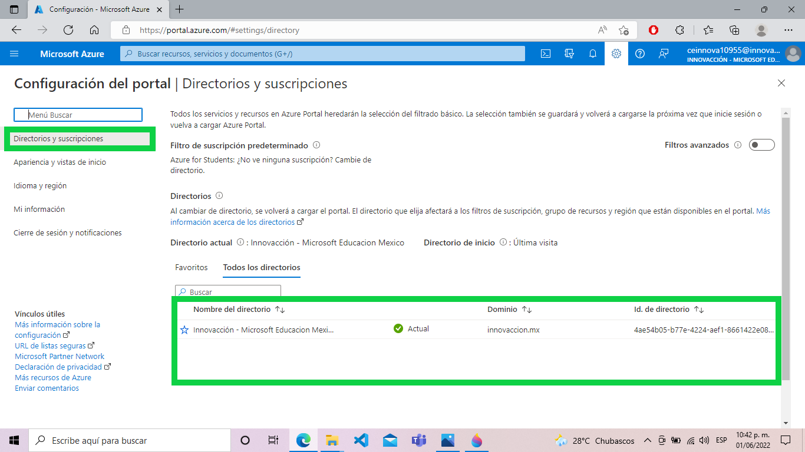
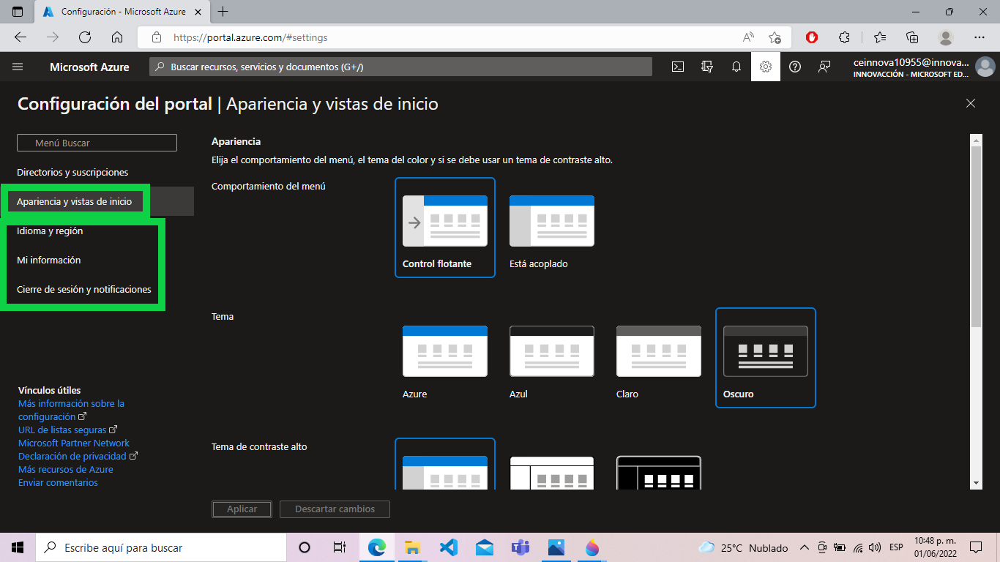
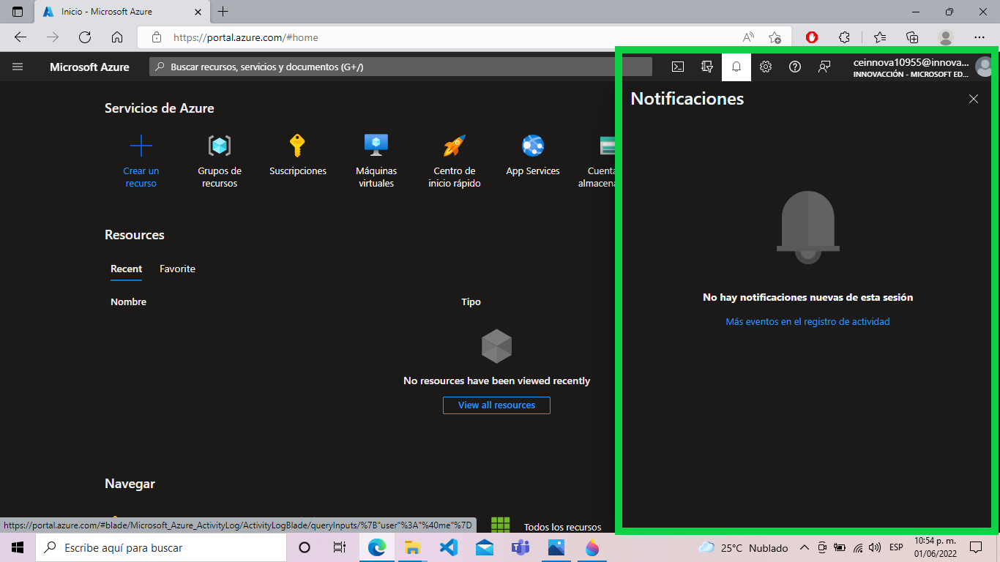

# Azure

-----------

**Sesión**
Primero iniciamos sesion a nueestra cuenta Azure.
De entrada podremos observar los siguientes datos:

Tenemos nuestra información de sesion.
Ahora seleccionamos la configuración.

**Directorios y suscripciones**

En esta pestaña se administran las diferentes sesiones que tenga el usuario, en este caso solo tenemos una.

**Apariencia y vista de inicio**

Aquí podemos modificar la apariencia de nuestra sesión a la que mejor se adapte a nuestras necesidades.

**Idioma y región**
Podemos configurar el idioma de nuestra preferencia, así como el de cada región.

**Mi información**
Tu información personal como correo

**Cierre de sesion y notificaciones**

Configurar el cierre de la sesion y las notificaciones de ello.

**Notificaciones**

Aqui nos alertara si se cerro algun recurso

