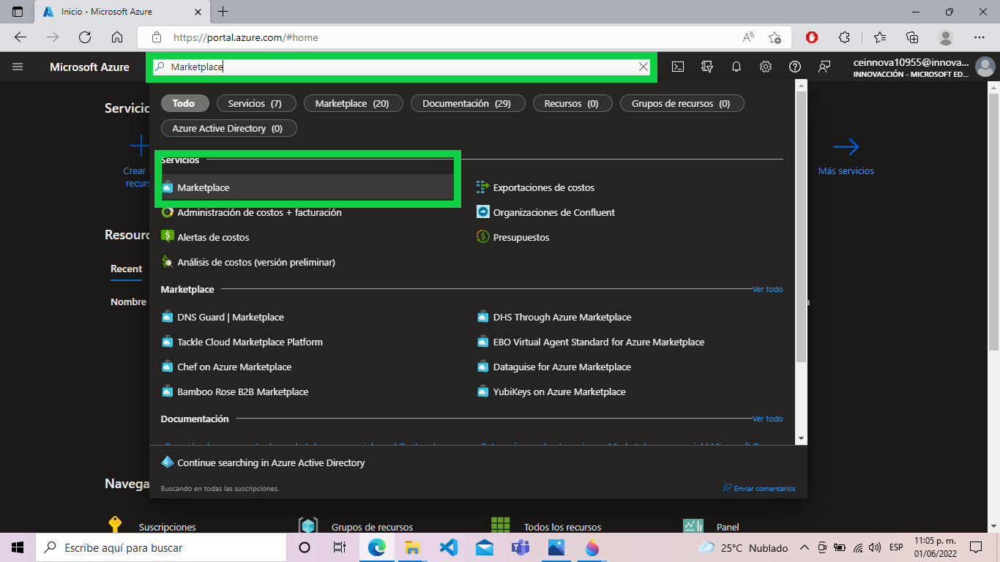
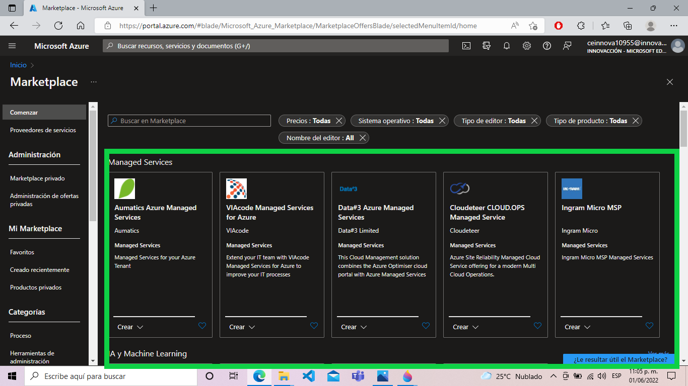
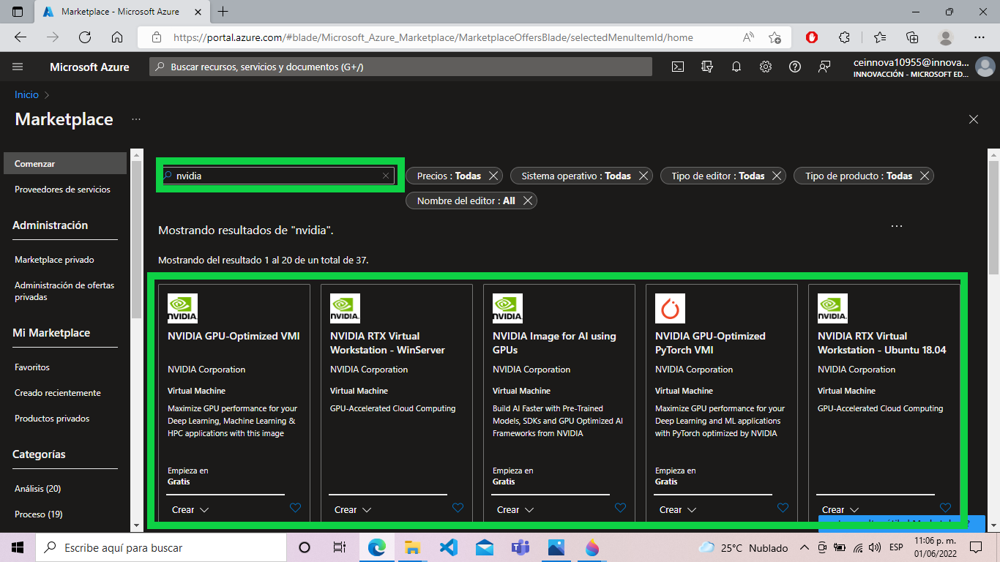

# Marketplace
--------

Azure tiene su tienda de servicios en linea.

Colocamos en el buscador Marketplace y la seleccionamos para observar todo los servicios.

Todos estos son los servicios que brida microsoft Azure

Incluso servicios de otras empresas.
Por ejemplo si colocamos "Nvidia" podemos observar tambien sus servicios.

