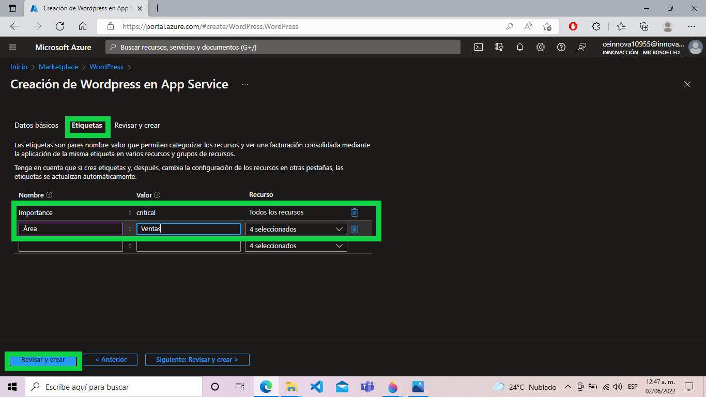
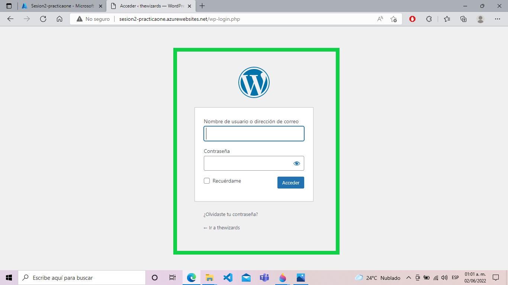

# Wordpress (PaaS)
-------

Para crear una página Web desde 0 con el servicio de Azure simplemente buscamos el servico de Wordpress.

Seleccionamos el servicio y le damos en crear.
Esto nos creará varios recursos de azure!

Usamos la **suscripción** que nos a dado Azure (Azure para estudiantes) (Se pueden tener varias suscripciones).

Creamos un nuevo **grupo de recursos**. Lo llamare "Sesion2-practica1"

La **región** se elige dependiendo donde se encuentran tus usuarios, por que entre mas lejano esté la región mayor latencia tendrá.

De **nombre** le pondremos 'sesion2-practicaone'.

Tambien tenemos etiquetas, estas solos sirven para 3 cosas.
*   Sacar reportes de costos.
*   Cumplir normativas de seguridad.
*   Dar mas información a quien no sepa de Azure.

Por ejemplo nombre= importante, valor=critical
o nombre = Área, Valor = Ventas.

Damos a Revisar y crear

Detalles de creación, y damos en crear.

Este proceso puede tardar un poco, nos comienza a crear los diversos servicios que se utilizarán.

Una vez completada la implementacion podemos acceder al recurso.

Una vez dentro observamos el nombre de nuestro carpeta de recursos, tambien las opciones para detener el recurso, esto para evitar pagar por recursos que no se esten aprovechando.

En la parte inferior observamos las etiquetas y en la parte derecha podemos acceder al link de la página de Wordpress.

Podemos seleccionar el idioma de preferencia.

Agregamos los datos del administrador para crear la cuenta de Wordpress.

Y listo ya podemos acceder a nuestra pagina en Wordpress.

Accedemos con nuestro usuario.

Y observamos nuestra página, esta todavia se debe modificar a corde a las necesidades de cada uno, pero ya podemos encontrar esta página en internet y cualquiera puede acceder a ella.

REgresando al grupo de recursos, podemos observar que tenemos 3 servicios activos.

'Sesion2-practica1' es el grupo de recursos de Azure para la página de Azure, podemos observar que no esta ningun servicio llamado Wordpress, porque Wordpress es un software para hacer páginas que se monta sobre estos 3 servicios.
*   App service: es el servicio de Azure, para hacer páginas web y aplicaciones web.
*   Plan de app service: nos sirve para hacer mas grande este servicio, por ejemplo escalarlo verticalmente u horizontalmente.

*   Servicio unico de Azure database for MySQL, guarda información. (este servicio cobra) hay que apagar o eliminar este servicio si no se esta usando.

Una vez desactivados los servicios, ya no podemos acceder, esto es necesario cuando un recurso o servicio no se esta usando para evitar que continue cobrando por este servico y agote nuestro crédito

